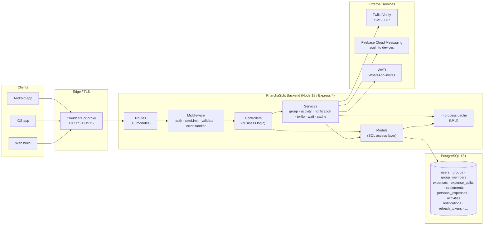
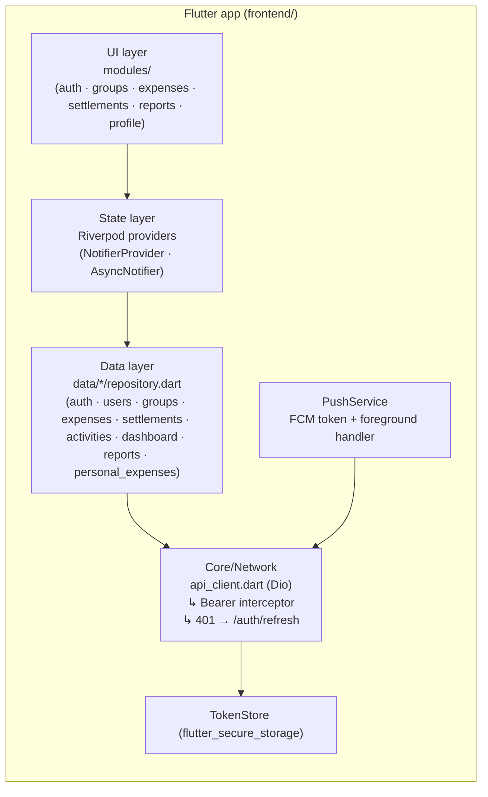
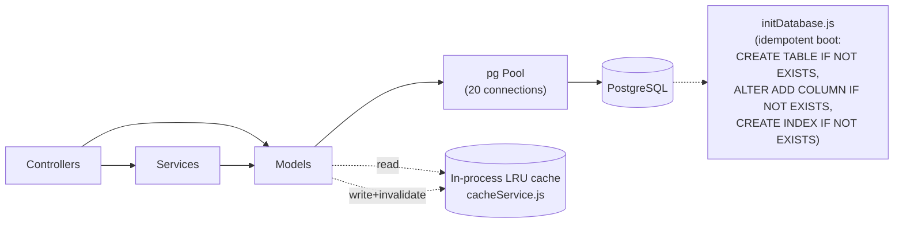
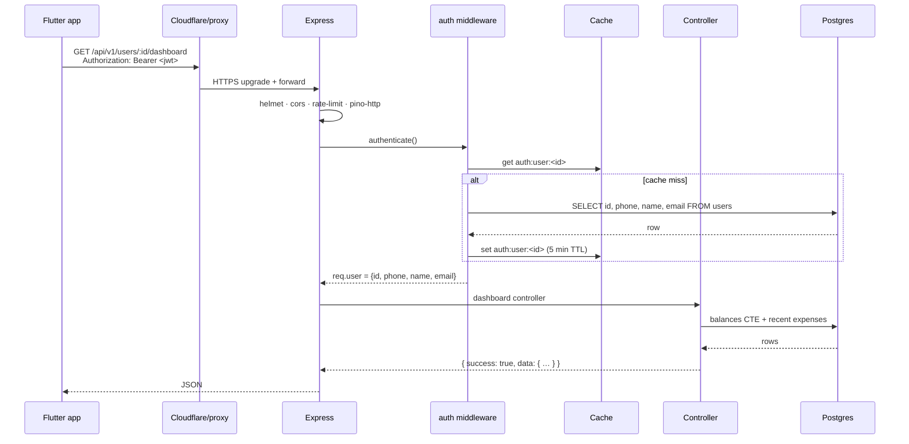
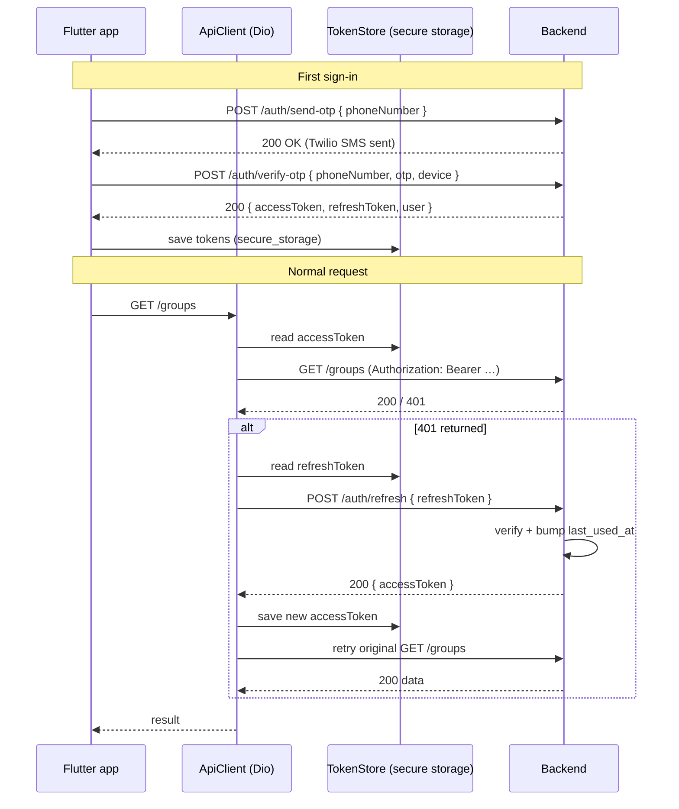
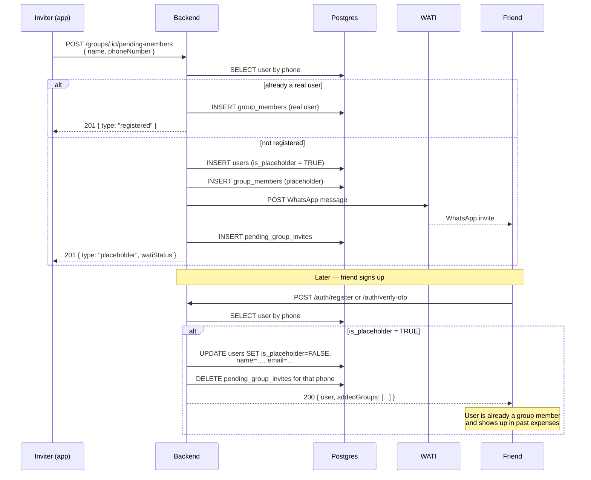
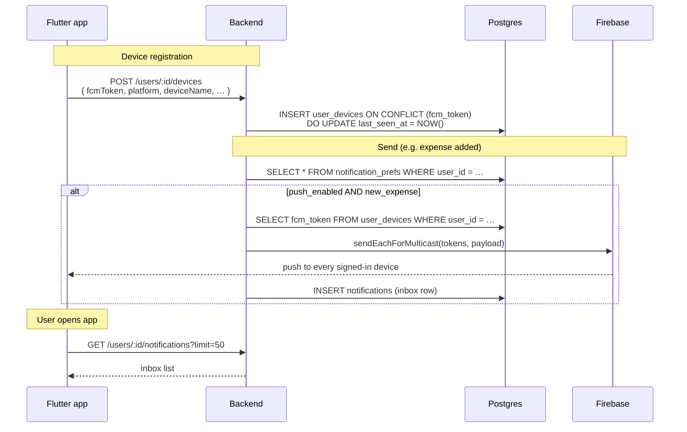
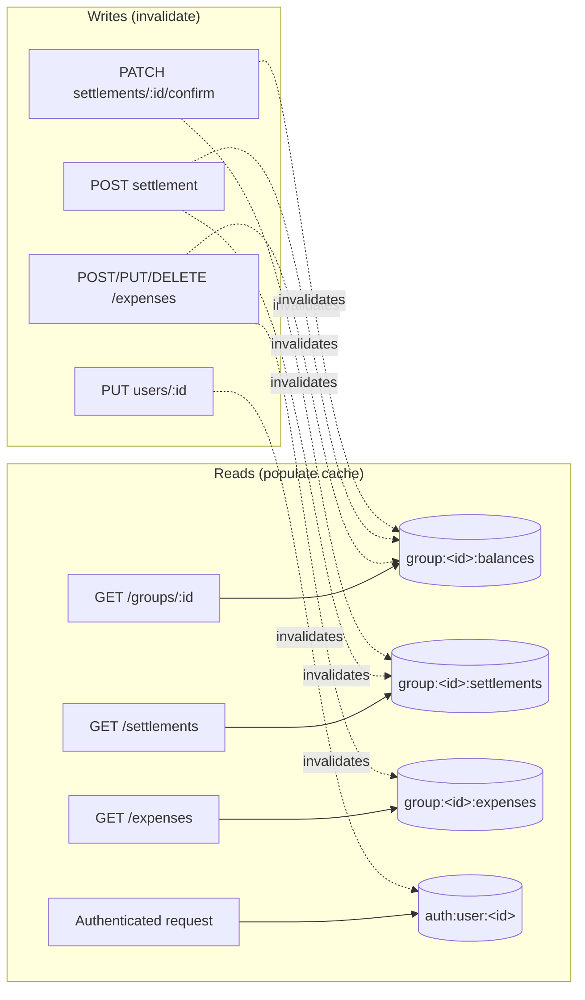
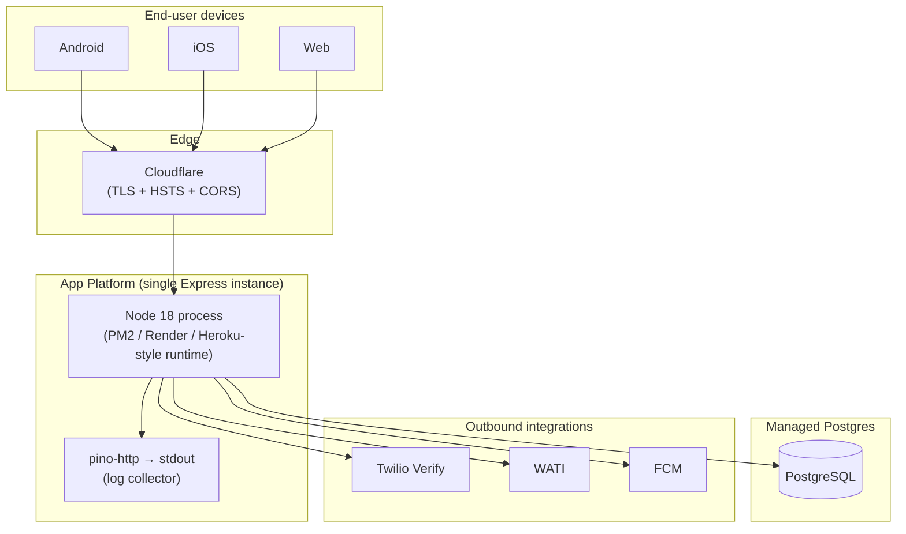

# KharchaSplit — System Architecture

End-to-end view of how the KharchaSplit Flutter client, Node/Express
backend, PostgreSQL database, and external services fit together.

Diagrams in this document are written in **Mermaid** — they render
natively on GitHub, VS Code, and the generated PDF.

---

## 1. Elevator pitch

A multi-device expense-splitting app. The Flutter client (Android, iOS,
and Web) talks to a single REST backend in Node/Express, which persists
to PostgreSQL. Authentication is phone-number + OTP (Twilio Verify).
Push notifications go through Firebase Cloud Messaging. Non-registered
group members are invited via WhatsApp through WATI. There are no
microservices — a single Express instance serves every request.

---

## 2. High-level system diagram



---

## 3. Client layer (Flutter)

Single codebase, three targets (Android / iOS / Web), Riverpod for
state, Dio for HTTP, `go_router` for navigation, Hive for offline
cache.



**Key client rules** (per `frontend/CLAUDE.md`):

- 3 responsive layouts per screen: compact `<600`, standard `600–1100`, large `>1100`.
- Riverpod everywhere — no `setState` for app-level state.
- `go_router` for navigation (deep links + web URLs work).
- All HTTP through one `ApiClient` so the auth interceptor + refresh
  flow apply to every call.

---

## 4. Backend layer (Express)

Classic MVC layout. Routes mount validators + middleware, controllers
hold business logic, services encapsulate cross-cutting work
(notifications, external APIs, caching), models do SQL.

```mermaid
flowchart TB
  REQ([HTTP request]) --> A1
  A1["server.js<br/>helmet · cors · rate-limit · body-parser · pino-http"] --> A2
  A2["Route module<br/>routes/{auth,users,groups,expenses,…}Routes.js"] --> A3
  A3["express-validator<br/>middleware/validation.js"] --> A4
  A4["JWT middleware<br/>middleware/auth.js<br/>(populates req.user)"] --> A5
  A5["Targeted rate limit<br/>middleware/rateLimits.js<br/>(otp · expenseCreate)"] --> A6
  A6["Controller<br/>controllers/*.js<br/>(business rules + authz)"] --> A7

  A7 --> S1["Service<br/>(group · activity · notification · twilio · wati · cache)"]
  A7 --> M1["Model<br/>(SQL via pg pool)"]
  S1 --> M1
  M1 --> DB[(PostgreSQL)]
  S1 -.-> Cache[("In-process cache<br/>cacheService.js")]
  M1 -.-> Cache

  A7 --> RESP([JSON response<br/>"{success, data, …}"])
  A8["middleware/errorHandler.js"] -.-> RESP
```

### 4.1 Layered responsibilities

| Layer       | Folder                    | Responsibility                                                                |
| ----------- | ------------------------- | ----------------------------------------------------------------------------- |
| Routes      | `src/routes/`             | Path → controller mapping. Validators + per-route rate limiters live here.    |
| Middleware  | `src/middleware/`         | `auth` (JWT), `validation` (express-validator), `rateLimits`, `errorHandler`. |
| Controllers | `src/controllers/`        | Request → response. Authorization checks, business rules, side-effect orchestration. |
| Services    | `src/services/`           | Reusable cross-cutting logic (notifications, external APIs, caching, balance math). |
| Models      | `src/models/`             | SQL queries against the `pg` pool. No business logic, just data access.       |
| Config      | `src/config/`             | Pool, init script (`initDatabase.js`), Firebase Admin init.                   |
| Utils       | `src/utils/`              | JWT helpers, OTP generator, logger (pino).                                    |

### 4.2 What's mounted in `server.js`

```
/api/v1/auth              → authRoutes
/api/v1/users             → userRoutes
/api/v1/groups            → groupRoutes
/api/v1/expenses          → expenseRoutes
/api/v1/settlements       → settlementRoutes
/api/v1/personal-expenses → personalExpenseRoutes
/api/v1/sync              → syncRoutes
/api/v1/activities        → activityRoutes
/api/v1/invites           → inviteRoutes
/api/v1/policies          → policiesRoutes
/health                   → inline handler
```

---

## 5. Data layer



**Notes**

- The cache is process-local (a single Map with TTL + LRU eviction).
  Fine for a single instance, **not safe** across multiple replicas —
  swap for Redis (`rate-limit-redis` + a Redis-backed cache) before
  horizontally scaling.
- `initDatabase.js` is the source of truth at runtime. The `migrations/`
  folder is historical — migrations have already been folded into the
  init script.

See `SCHEMA.md` for the full table inventory and ER diagram.

---

## 6. External services

| Service                       | Purpose                                | Where it's called from                          |
| ----------------------------- | -------------------------------------- | ----------------------------------------------- |
| **Twilio Verify**             | Phone OTP for sign-in (`send-otp` / `verify-otp`). | `src/services/twilioService.js`                |
| **Firebase Cloud Messaging**  | Push notifications to user devices.    | `src/services/notificationService.js` (uses `firebase-admin`). |
| **WATI**                      | WhatsApp invites for non-registered users when added to a group. | `src/services/watiService.js`                  |

All three are **non-fatal** at boot — if env vars are missing, the
server still starts; the corresponding feature short-circuits with a
clean error response (Twilio: `OTP service not configured`; WATI:
silently skipped; FCM: push delivery is a no-op).

---

## 7. Request lifecycle — authenticated GET



---

## 8. Auth + refresh-token flow



The interceptor lives in `frontend/lib/core/network/api_client.dart` —
**every** Dio call benefits from automatic refresh. Refresh tokens
expire after 30 days of inactivity (`last_used_at` is bumped on each
use).

---

## 9. Placeholder user + WATI invite flow

The "invite by phone" flow is one of the more interesting domain pieces
— it lets users build a group with friends who haven't installed the
app yet, and lets expenses reference those friends immediately. When
the friend later signs up, the same row is converted in place so they
keep all their history.



---

## 10. Push notification flow



**Reminder rate limit (data-driven):**

`POST /groups/:id/remind/:userId` checks the `notifications` table for
any row in the last 6 h with the same `(target user, type='SETTLEMENT_REMINDER', fromUserId, groupId)` — if found, returns
429. So the rate-limit lives in the data, not in middleware.

---

## 11. Reads / writes — what hits the cache



---

## 12. Deployment topology

Single-region, single-instance Express container behind a TLS-terminating
proxy (Cloudflare / Render / nginx). PostgreSQL is managed (RDS / Render
Postgres / equivalent).



**Notes**

- `trust proxy = 1` in production so `req.secure` and `x-forwarded-*`
  reflect the real client.
- HTTP → HTTPS redirect (308) + HSTS (1 year, preload) is on in
  production.
- The body limit is 10 MB to accommodate base64 receipts.
- Graceful shutdown drains in-flight requests then closes the pg pool.
- The current setup is **not horizontally scaled** — the in-process
  rate limiter and cache make multi-instance unsafe. Move both to
  Redis before scaling out.

---

## 13. Failure modes and fallbacks

| Failure                                | Behavior                                                            |
| -------------------------------------- | ------------------------------------------------------------------- |
| Twilio not configured                  | `/auth/send-otp` returns 500 with a clear error; client falls back to dev flow. |
| Twilio Verify rejects code             | Mapped to 401 `Invalid OTP` (404 from Twilio = "OTP expired").       |
| WATI not configured / API failure       | `pending_group_invites` row still written with `wati_status = 'failed'`; user can resend later. The placeholder member is still added to the group. |
| FCM send fails                         | Logged + the inbox row is still written (so the user sees it in-app). |
| Postgres connection drop               | `pg` pool retries; if unreachable at boot, the server exits 1.       |
| Pre-signed access token expires (401)  | Dio interceptor refreshes silently and retries the original request. |
| Refresh token expired / revoked        | Client clears credentials and routes to login.                      |
| Body > 10 MB                           | Express returns 413 `Request body too large. Try a smaller image.`   |
| Rate limit tripped                     | 429 with a typed message (`Too many OTP requests…`, `Too many expenses…`, `You've already reminded this person…`). |

---

## 14. Tech stack at a glance

| Layer        | Choice                                                              |
| ------------ | ------------------------------------------------------------------- |
| Client       | Flutter (Dart) · Riverpod · Dio · go_router · Hive · cached_network_image · intl |
| Backend      | Node 18 · Express 4 · express-validator · express-rate-limit · helmet · compression · pino |
| Auth         | JWT (jsonwebtoken) · Twilio Verify · `flutter_secure_storage` (client) |
| Database     | PostgreSQL 13+ (`gen_random_uuid()`, `JSONB`, partial indexes)       |
| Push         | Firebase Cloud Messaging (firebase-admin)                            |
| WhatsApp     | WATI                                                                |
| Logging      | pino + pino-http (stdout, with redaction)                            |
| Hosting      | Single container behind Cloudflare; managed Postgres                 |
| Build / CI   | npm scripts, Jest for backend tests (currently stub)                 |

---

## 15. One-line summary

> Flutter client → HTTPS → single Express process → PostgreSQL.
> JWT for auth (with refresh). Twilio for OTP, FCM for push, WATI for
> WhatsApp invites. All caching, rate-limiting, and notification logic
> lives in the one Node process today — Redis is the next stop when
> we scale out.
