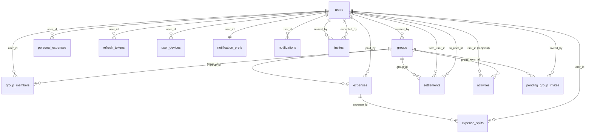

# KharchaSplit Backend — Data Model & Database Schema

PostgreSQL schema that backs the KharchaSplit Express API. Generated
from the authoritative live source: `backend/src/config/initDatabase.js`
(which runs at every server start) plus the historical migrations under
`backend/migrations/`.

---

## 1. Conventions

| Concern              | Convention                                                                 |
| -------------------- | -------------------------------------------------------------------------- |
| Engine               | PostgreSQL (uses `gen_random_uuid()` — `pgcrypto` / built-in 13+).         |
| Primary keys         | `UUID` defaulted to `gen_random_uuid()` (older tables use `uuid_generate_v4()`). |
| Time columns         | `TIMESTAMP` (server time). Triggers maintain `updated_at` where present.   |
| Soft delete          | `deleted_at TIMESTAMP NULL` on most tables. `NULL` = live, non-NULL = gone.|
| Booleans             | Backed by `BOOLEAN` (not smallint). Defaults always set.                   |
| Currency             | `VARCHAR(10)` with default `'INR'`. ISO-4217 codes only (no symbols).      |
| Money                | `DECIMAL(12, 2)` (older tables: `DECIMAL(15, 2)`). Two-decimal precision.  |
| JSON                 | `JSONB` everywhere we use document storage (activities/notifications).    |
| Cascade              | Child rows that depend on a parent (group_members, expenses, splits, …)   |
|                      | use `ON DELETE CASCADE`. Settlements + invites cascade off `groups`.       |
| Naming               | `snake_case` columns. App converts to `camelCase` at the controller layer. |
| Phone format         | E.164 — regex `^\+?[1-9]\d{1,14}$`. App normalises to `+91XXXXXXXXXX` for India. |

---

## 2. ER diagram



---

## 3. Core entities

### 3.1 `users`

Profile + auth identity. One row per phone number. Supports a
"placeholder" mode where a row exists for someone invited by phone
but who hasn't installed the app yet — when they sign up, the
placeholder is converted in place (so they inherit any group
memberships + expense history) by `User.convertPlaceholderToReal()`.

| Column                  | Type           | Default              | Notes                                                  |
| ----------------------- | -------------- | -------------------- | ------------------------------------------------------ |
| `id` (PK)               | UUID           | `gen_random_uuid()`  |                                                        |
| `phone_number`          | VARCHAR(20)    | —                    | `UNIQUE NOT NULL`. E.164. `users_phone_number_key`.    |
| `name`                  | VARCHAR(100)   | NULL                 | Empty on a freshly created placeholder.                |
| `email`                 | VARCHAR(255)   | NULL                 | Optional.                                              |
| `profile_image_base64`  | TEXT           | NULL                 | Base64-encoded PNG/JPG, no MIME prefix.                |
| `preferred_currency`    | VARCHAR(10)    | `'INR'`              | User's display currency. ISO-4217.                     |
| `is_placeholder`        | BOOLEAN        | `FALSE`              | `TRUE` for phone-only stub rows awaiting registration. |
| `fcm_token`             | VARCHAR(255)   | NULL                 | **Legacy** single-device token; new code uses `user_devices`. Kept for backfill. |
| `fcm_token_updated_at`  | TIMESTAMP      | NULL                 | Legacy.                                                |
| `created_at`            | TIMESTAMP      | `NOW()`              |                                                        |
| `updated_at`            | TIMESTAMP      | `NOW()`              | Trigger-maintained (legacy schema only).               |
| `deleted_at`            | TIMESTAMP      | NULL                 | Soft delete.                                           |

**Indexes**

| Name                              | Definition                                                                             |
| --------------------------------- | -------------------------------------------------------------------------------------- |
| `users_phone_number_key` (UNIQUE) | `phone_number`                                                                         |
| `idx_users_fcm_token`             | `(fcm_token) WHERE fcm_token IS NOT NULL`                                              |
| `idx_users_phone_normalized`      | Functional: `RIGHT(REGEXP_REPLACE(phone_number, '[^0-9]', '', 'g'), 10)` — for last-10-digit lookups. |

**Constraints**

- `CHECK (phone_number ~ '^\+?[1-9]\d{1,14}$')` (legacy migration adds this; new code relies on validator).

---

### 3.2 `groups`

Expense-sharing groups. `created_by` is preserved even if the user
later leaves. `simplified_debts` is on by default — when true, the
balances API merges chains of debt (A→B→C becomes A→C).

| Column                | Type         | Default              | Notes                                          |
| --------------------- | ------------ | -------------------- | ---------------------------------------------- |
| `id` (PK)             | UUID         | `gen_random_uuid()`  |                                                |
| `name`                | VARCHAR(100) | —                    | `NOT NULL`, 2–255 chars via validator.        |
| `description`         | TEXT         | NULL                 |                                                |
| `created_by`          | UUID FK→users(id) | —              |                                                |
| `cover_image_base64`  | TEXT         | NULL                 | Optional group photo (base64).                 |
| `currency`            | VARCHAR(10)  | `'INR'`              | Display currency for this group.               |
| `default_currency`    | VARCHAR(10)  | `'INR'`              | Currency used when creating a new expense.     |
| `simplified_debts`    | BOOLEAN      | `TRUE`               | If true, balances API simplifies debt chains. |
| `is_archived`         | BOOLEAN      | `FALSE`              | Hidden from active view but data preserved.    |
| `archived_at`         | TIMESTAMP    | NULL                 | When archived (added by migration 005).        |
| `created_at`          | TIMESTAMP    | `NOW()`              |                                                |
| `updated_at`          | TIMESTAMP    | `NOW()`              |                                                |
| `deleted_at`          | TIMESTAMP    | NULL                 | Soft delete (blocked by API if any balance != 0). |

**Notes**

- Both `currency` and `default_currency` exist for legacy reasons; controllers read whichever is populated, with `INR` fallback.

---

### 3.3 `group_members`

Membership rows. Carries denormalized name/phone/email so an expense
created against a placeholder member still has display text even if
that user's row is later deleted. `UNIQUE(group_id, user_id)` prevents
duplicate memberships.

| Column         | Type         | Default              | Notes                                                                |
| -------------- | ------------ | -------------------- | -------------------------------------------------------------------- |
| `id` (PK)      | UUID         | `gen_random_uuid()`  |                                                                      |
| `group_id`     | UUID FK→groups(id) `ON DELETE CASCADE` | — |                                                                      |
| `user_id`      | UUID FK→users(id) | —              |                                                                      |
| `role`         | VARCHAR(20)  | `'member'`           | `'creator' \| 'admin' \| 'member'`.                                  |
| `name`         | VARCHAR(100) | NULL                 | Snapshotted from `users.name` at add time.                           |
| `phone_number` | VARCHAR(20)  | NULL                 | Snapshotted.                                                         |
| `email`        | VARCHAR(255) | NULL                 | Snapshotted.                                                         |
| `added_by`     | UUID         | NULL                 | The inviter's user id.                                               |
| `joined_at`    | TIMESTAMP    | `NOW()`              |                                                                      |
| `left_at`      | TIMESTAMP    | NULL                 | Set when the user leaves (alongside `deleted_at`).                   |
| `deleted_at`   | TIMESTAMP    | NULL                 | Soft delete.                                                         |

**Indexes**

| Name                          | Definition                                                                                |
| ----------------------------- | ----------------------------------------------------------------------------------------- |
| `UNIQUE (group_id, user_id)`  | also used for fast `group_id` prefix lookups.                                             |
| `idx_group_members_user`      | `(user_id)` — for "my groups" lookups.                                                    |
| `idx_group_members_active`    | `(group_id, user_id, role, joined_at) WHERE deleted_at IS NULL` — covering index for hot path. |

---

### 3.4 `expenses`

A single bill someone paid that's being split. The participant breakdown
lives in `expense_splits`.

| Column            | Type         | Default              | Notes                                                                  |
| ----------------- | ------------ | -------------------- | ---------------------------------------------------------------------- |
| `id` (PK)         | UUID         | `gen_random_uuid()`  |                                                                        |
| `group_id`        | UUID FK→groups(id) `ON DELETE CASCADE` | — |                                                                        |
| `description`     | VARCHAR(255) | —                    | `NOT NULL`. 1–500 chars enforced by validator.                         |
| `amount`          | DECIMAL(12,2)| —                    | Non-negative. Validator enforces `amount >= 0`.                        |
| `currency`        | VARCHAR(10)  | `'INR'`              |                                                                        |
| `paid_by`         | UUID FK→users(id) | NULL           | Current payer column. Read everywhere.                                 |
| `paid_by_id`      | UUID FK→users(id) | NULL           | **Legacy**. Was NOT NULL; relaxed by migration 012. Backfilled to `paid_by`. |
| `paid_by_name`    | VARCHAR(255) | NULL                 | **Legacy** denormalized name. Relaxed by migration 012.                |
| `category`        | VARCHAR(50)  | NULL                 | Free-form (e.g. `food`, `travel`).                                     |
| `expense_date`    | DATE         | `CURRENT_DATE`       | Business date for the expense (not row create time).                   |
| `split_type`      | VARCHAR(20)  | `'equal'`            | `'equal' \| 'unequal' \| 'exact' \| 'percentage' \| 'shares'`.         |
| `receipt_base64`  | TEXT         | NULL                 | Up to ~10 MB body limit per request.                                   |
| `notes`           | TEXT         | NULL                 |                                                                        |
| `is_deleted`      | BOOLEAN      | `FALSE`              | Legacy delete flag. New code uses `deleted_at`.                        |
| `created_at`      | TIMESTAMP    | `NOW()`              |                                                                        |
| `updated_at`      | TIMESTAMP    | `NOW()`              |                                                                        |
| `deleted_at`      | TIMESTAMP    | NULL                 | Soft delete.                                                           |

**Indexes**

| Name                         | Definition                                                                                |
| ---------------------------- | ----------------------------------------------------------------------------------------- |
| `idx_expenses_paid_by`       | `(paid_by)`                                                                               |
| `idx_expenses_group_active`  | `(group_id, expense_date DESC, created_at DESC) WHERE deleted_at IS NULL` — hot path.    |

**Authorization**

- Only the original payer (`paid_by`) may edit or delete an expense.

---

### 3.5 `expense_splits`

One row per participant per expense. The sum of `amount` across an
expense's splits should equal the expense `amount`. (The Flutter app
guarantees this; the DB doesn't enforce it.)

| Column         | Type         | Default              | Notes                                                |
| -------------- | ------------ | -------------------- | ---------------------------------------------------- |
| `id` (PK)      | UUID         | `gen_random_uuid()`  |                                                      |
| `expense_id`   | UUID FK→expenses(id) `ON DELETE CASCADE` | — |                                                      |
| `user_id`      | UUID FK→users(id) | —              |                                                      |
| `amount`       | DECIMAL(12,2)| —                    | `NOT NULL`. The actual money owed by this user.      |
| `percentage`   | DECIMAL(5,2) | NULL                 | Only populated when `split_type='percentage'`.       |
| `shares`       | INTEGER      | NULL                 | Only populated when `split_type='shares'`.           |
| `is_settled`   | BOOLEAN      | `FALSE`              | Set true when this split is covered by a settlement. |
| `created_at`   | TIMESTAMP    | `NOW()`              |                                                      |
| `deleted_at`   | TIMESTAMP    | NULL                 |                                                      |

**Indexes**

| Name                         | Definition                                                  |
| ---------------------------- | ----------------------------------------------------------- |
| `idx_expense_splits_batch`   | `(expense_id, amount DESC)` — covers single + batch lookups.|
| `idx_expense_splits_user`    | `(user_id)`                                                 |

---

### 3.6 `settlements`

A pairwise payment that reduces outstanding debt in a group. Created
by the payer, confirmed by the recipient (two-step). Affects balances
exactly like an expense in reverse.

| Column         | Type         | Default              | Notes                                                                  |
| -------------- | ------------ | -------------------- | ---------------------------------------------------------------------- |
| `id` (PK)      | UUID         | `gen_random_uuid()`  |                                                                        |
| `group_id`     | UUID FK→groups(id) `ON DELETE CASCADE` | — |                                                                        |
| `from_user_id` | UUID FK→users(id) | —              | The payer. Must equal `req.user.id` on create.                         |
| `to_user_id`   | UUID FK→users(id) | —              | The recipient. Only this user may confirm.                             |
| `amount`       | DECIMAL(12,2)| —                    | Non-negative.                                                          |
| `currency`     | VARCHAR(10)  | `'INR'`              |                                                                        |
| `status`       | VARCHAR(20)  | `'pending'`          | `'pending' \| 'confirmed' \| 'paid' \| 'failed' \| 'cancelled'`.       |
| `notes`        | TEXT         | NULL                 |                                                                        |
| `confirmed_at` | TIMESTAMP    | NULL                 | Set when `to_user_id` confirms.                                        |
| `settled_at`   | TIMESTAMP    | `NOW()`              | Initial create time (semantically separate from confirmed).            |
| `created_at`   | TIMESTAMP    | `NOW()`              |                                                                        |
| `deleted_at`   | TIMESTAMP    | NULL                 |                                                                        |

**Indexes**

| Name                            | Definition                                                                                            |
| ------------------------------- | ----------------------------------------------------------------------------------------------------- |
| `idx_settlements_group_active`  | `(group_id, created_at DESC) WHERE deleted_at IS NULL`                                                |
| `idx_settlements_pending`       | `(group_id, from_user_id, to_user_id) WHERE status='pending' AND deleted_at IS NULL` — duplicate guard. |

**Constraints**

- `CHECK (from_user_id != to_user_id)` — can't pay yourself.

**Balance math**

The dashboard / group balance queries union expense contributions
**and** settlement contributions, so a confirmed settlement immediately
reduces the outstanding number for both users. Settlements with
`status IN ('failed', 'cancelled')` are excluded.

---

### 3.7 `personal_expenses`

Private to one user; never visible to anyone else. No group, no splits.

| Column           | Type         | Default              | Notes                          |
| ---------------- | ------------ | -------------------- | ------------------------------ |
| `id` (PK)        | UUID         | `gen_random_uuid()`  |                                |
| `user_id`        | UUID FK→users(id) | —              | Owner.                         |
| `description`    | VARCHAR(255) | —                    | `NOT NULL`, 1–500 chars.       |
| `amount`         | DECIMAL(12,2)| —                    | Non-negative.                  |
| `currency`       | VARCHAR(10)  | `'INR'`              |                                |
| `category`       | VARCHAR(50)  | NULL                 |                                |
| `expense_date`   | TIMESTAMP    | `NOW()`              |                                |
| `receipt_base64` | TEXT         | NULL                 |                                |
| `notes`          | TEXT         | NULL                 |                                |
| `is_deleted`     | BOOLEAN      | `FALSE`              | Legacy. New code uses `deleted_at`. |
| `created_at`     | TIMESTAMP    | `NOW()`              |                                |
| `updated_at`     | TIMESTAMP    | `NOW()`              |                                |
| `deleted_at`     | TIMESTAMP    | NULL                 |                                |

**Indexes**

| Name                                  | Definition                                                                                |
| ------------------------------------- | ----------------------------------------------------------------------------------------- |
| `idx_personal_expenses_user_active`   | `(user_id, expense_date DESC, created_at DESC) WHERE deleted_at IS NULL` — paginated list.|

---

### 3.8 `activities`

Activity-feed rows that appear in the user's bell-icon list. Written
server-side by controllers via `ActivityService` (the `POST /activities`
endpoint exists but is rarely used).

| Column          | Type         | Default              | Notes                                                                      |
| --------------- | ------------ | -------------------- | -------------------------------------------------------------------------- |
| `id` (PK)       | UUID         | `gen_random_uuid()`  |                                                                            |
| `user_id`       | UUID FK→users(id) | —              | Recipient.                                                                 |
| `group_id`      | UUID FK→groups(id) `ON DELETE CASCADE` | NULL | Optional — direct/user-scope activities have NULL.                         |
| `activity_type` | VARCHAR(50)  | —                    | `NOT NULL`. e.g. `group_created`, `expense_added`, `settlement_confirmed`. |
| `entity_type`   | VARCHAR(50)  | NULL                 | `'group' \| 'member' \| 'expense' \| 'settlement'`.                        |
| `entity_id`     | UUID         | NULL                 | FK target (not enforced).                                                  |
| `title`         | VARCHAR(255) | NULL                 |                                                                            |
| `description`   | TEXT         | NULL                 |                                                                            |
| `metadata`      | JSONB        | NULL                 | Free-form (amounts, names, etc.).                                          |
| `is_read`       | BOOLEAN      | `FALSE`              |                                                                            |
| `created_at`    | TIMESTAMP    | `NOW()`              |                                                                            |
| `deleted_at`    | TIMESTAMP    | NULL                 |                                                                            |

**Indexes**

| Name                          | Definition                                                              |
| ----------------------------- | ----------------------------------------------------------------------- |
| `idx_activities_user_feed`    | `(user_id, created_at DESC) WHERE deleted_at IS NULL` — bell-icon feed. |
| `idx_activities_group_feed`   | `(group_id, created_at DESC) WHERE deleted_at IS NULL`                  |
| `idx_activities_unread`       | `(user_id, is_read) WHERE deleted_at IS NULL AND is_read = FALSE`       |

---

## 4. Notification stack

### 4.1 `notification_prefs`

One row per user. Lazily created on first PUT — `GET` returns defaults
without writing the row.

| Column                | Type      | Default              | Notes                                                |
| --------------------- | --------- | -------------------- | ---------------------------------------------------- |
| `user_id` (PK)        | UUID FK→users(id) `ON DELETE CASCADE` | — | One-to-one with `users`.                             |
| `push_enabled`        | BOOLEAN   | `TRUE`               | Master push switch.                                  |
| `email_enabled`       | BOOLEAN   | `FALSE`              | Email channel (not used yet).                        |
| `new_expense`         | BOOLEAN   | `TRUE`               | Per-type toggles below — each gates the matching push.|
| `group_invite`        | BOOLEAN   | `TRUE`               |                                                      |
| `payment_received`    | BOOLEAN   | `TRUE`               |                                                      |
| `settlement_reminder` | BOOLEAN   | `TRUE`               |                                                      |
| `comment_mention`     | BOOLEAN   | `TRUE`               |                                                      |
| `weekly_summary`      | BOOLEAN   | `FALSE`              |                                                      |
| `product_updates`     | BOOLEAN   | `FALSE`              |                                                      |
| `updated_at`          | TIMESTAMP | `CURRENT_TIMESTAMP`  |                                                      |

---

### 4.2 `user_devices`

Multi-device FCM token registry. Replaces the legacy `users.fcm_token`
column (kept for backfill).

| Column          | Type         | Default              | Notes                                                                  |
| --------------- | ------------ | -------------------- | ---------------------------------------------------------------------- |
| `id` (PK)       | UUID         | `gen_random_uuid()`  |                                                                        |
| `user_id`       | UUID FK→users(id) `ON DELETE CASCADE` | — |                                                                        |
| `fcm_token`     | TEXT         | —                    | `NOT NULL`. `UNIQUE` — makes the `ON CONFLICT` upsert idempotent.      |
| `platform`      | VARCHAR(20)  | NULL                 | `'android' \| 'ios' \| 'web'`.                                          |
| `device_name`   | VARCHAR(255) | NULL                 |                                                                        |
| `os_version`    | VARCHAR(80)  | NULL                 |                                                                        |
| `app_version`   | VARCHAR(40)  | NULL                 |                                                                        |
| `last_seen_at`  | TIMESTAMP    | `CURRENT_TIMESTAMP`  | Bumped on every successful push delivery.                              |
| `created_at`    | TIMESTAMP    | `CURRENT_TIMESTAMP`  |                                                                        |

**Indexes**

| Name                              | Definition           |
| --------------------------------- | -------------------- |
| `user_devices_fcm_token_key` (UNIQUE) | `(fcm_token)`    |
| `idx_user_devices_user_id`        | `(user_id)`          |
| `idx_user_devices_last_seen`      | `(last_seen_at)`     |

---

### 4.3 `notifications` (inbox)

One row per delivered push. Persistent in-app inbox so the bell icon
keeps history after the OS push is dismissed.

| Column        | Type     | Default              | Notes                                                                  |
| ------------- | -------- | -------------------- | ---------------------------------------------------------------------- |
| `id` (PK)     | UUID     | `gen_random_uuid()`  |                                                                        |
| `user_id`     | UUID FK→users(id) `ON DELETE CASCADE` | — |                                                                        |
| `type`        | VARCHAR(50) | —                 | e.g. `EXPENSE_ADDED`, `SETTLEMENT_REMINDER`, `MEMBER_REMOVED`.         |
| `title`       | TEXT     | —                    |                                                                        |
| `body`        | TEXT     | —                    |                                                                        |
| `data`        | JSONB    | `'{}'`               | Deep-link payload (groupId, fromUserId, etc.).                         |
| `is_read`     | BOOLEAN  | `FALSE`              |                                                                        |
| `read_at`     | TIMESTAMP| NULL                 |                                                                        |
| `created_at`  | TIMESTAMP| `CURRENT_TIMESTAMP`  |                                                                        |

**Indexes**

| Name                              | Definition                                            |
| --------------------------------- | ----------------------------------------------------- |
| `idx_notifications_user_created`  | `(user_id, created_at DESC)`                          |
| `idx_notifications_user_unread`   | `(user_id) WHERE is_read = FALSE` — drives bell badge.|

---

## 5. Invitation tables

The app has **three** distinct invitation flows, each with its own
table. (Yes, this is more than ideal — they grew organically.)

### 5.1 `pending_group_invites`

WhatsApp invites sent via WATI to non-registered phone numbers. A row
here is paired with a `placeholder` user in `users`. Unique on
`(group_id, phone_number)`.

| Column            | Type         | Default              | Notes                                                                  |
| ----------------- | ------------ | -------------------- | ---------------------------------------------------------------------- |
| `id` (PK)         | UUID         | `gen_random_uuid()`  |                                                                        |
| `group_id`        | UUID FK→groups(id) `ON DELETE CASCADE` | — |                                                                        |
| `phone_number`    | VARCHAR(20)  | —                    | `NOT NULL`. E.164.                                                     |
| `name`            | VARCHAR(100) | NULL                 |                                                                        |
| `email`           | VARCHAR(255) | NULL                 |                                                                        |
| `invited_by`      | UUID FK→users(id) | —              |                                                                        |
| `wati_message_id` | VARCHAR(100) | NULL                 | WATI message handle for status tracking.                               |
| `wati_status`     | VARCHAR(20)  | `'pending'`          | `'pending' \| 'sent' \| 'delivered' \| 'read' \| 'failed'`.            |
| `wati_error`      | TEXT         | NULL                 |                                                                        |
| `wati_sent_at`    | TIMESTAMP    | NULL                 |                                                                        |
| `invite_count`    | INTEGER      | `1`                  | Incremented on each resend.                                            |
| `last_invited_at` | TIMESTAMP    | `NOW()`              |                                                                        |
| `created_at`      | TIMESTAMP    | `NOW()`              |                                                                        |

**Indexes**

| Name                                | Definition                       |
| ----------------------------------- | -------------------------------- |
| `UNIQUE (group_id, phone_number)`   | duplicate guard                   |
| `idx_pending_invites_group_phone`   | `(group_id, phone_number)`       |
| `idx_pending_invites_phone`         | `(phone_number)`                 |

---

### 5.2 `group_invites`

Group-scoped invite links (not currently exposed via the API — internal
infrastructure for a future flow).

| Column            | Type        | Default              | Notes                  |
| ----------------- | ----------- | -------------------- | ---------------------- |
| `id` (PK)         | UUID        | `gen_random_uuid()`  |                        |
| `group_id`        | UUID FK→groups(id) `ON DELETE CASCADE` | — |   |
| `invited_by`      | UUID FK→users(id) | —              |                        |
| `invited_phone`   | VARCHAR(20) | NULL                 |                        |
| `invited_user_id` | UUID FK→users(id) | NULL           |                        |
| `status`          | VARCHAR(20) | `'pending'`          |                        |
| `invite_code`     | VARCHAR(50) | NULL                 | `UNIQUE`.              |
| `expires_at`      | TIMESTAMP   | NULL                 |                        |
| `created_at`      | TIMESTAMP   | `NOW()`              |                        |
| `responded_at`    | TIMESTAMP   | NULL                 |                        |

---

### 5.3 `invites` (referral)

Share-sheet referral codes (`/api/v1/invites/*`). Valid for 30 days.

| Column         | Type         | Default              | Notes                                                  |
| -------------- | ------------ | -------------------- | ------------------------------------------------------ |
| `id` (PK)      | UUID         | `gen_random_uuid()`  |                                                        |
| `invite_code`  | VARCHAR(20)  | —                    | `UNIQUE NOT NULL`. 8-char hex generated server-side.   |
| `invited_by`   | UUID FK→users(id) | —              |                                                        |
| `phone_number` | VARCHAR(20)  | —                    | `NOT NULL`.                                            |
| `context`      | JSONB        | NULL                 | e.g. `{ "groupName": "..." }` — populates share text.  |
| `status`       | VARCHAR(20)  | `'pending'`          | `'pending' \| 'accepted' \| 'expired' \| 'cancelled'`. |
| `accepted_by`  | UUID FK→users(id) | NULL           |                                                        |
| `accepted_at`  | TIMESTAMP    | NULL                 |                                                        |
| `expires_at`   | TIMESTAMP    | —                    | 30 days from create.                                   |
| `created_at`   | TIMESTAMP    | `NOW()`              |                                                        |
| `deleted_at`   | TIMESTAMP    | NULL                 | Soft delete (used by Cancel).                          |

**Indexes**

| Name                       | Definition                                                                |
| -------------------------- | ------------------------------------------------------------------------- |
| `invites_invite_code_key` (UNIQUE) | `(invite_code)`                                                   |
| `idx_invites_invited_by`   | `(invited_by, created_at DESC) WHERE deleted_at IS NULL`                  |
| `idx_invites_phone`        | `(phone_number) WHERE deleted_at IS NULL`                                 |

---

## 6. Auth tables

### 6.1 `otps`

Short-lived OTP rows used by `/auth/register`. (The newer `/auth/send-otp`
+ `/auth/verify-otp` flow uses **Twilio Verify** and does NOT write to
this table — kept for the legacy register path.)

| Column         | Type         | Default              | Notes                  |
| -------------- | ------------ | -------------------- | ---------------------- |
| `id` (PK)      | UUID         | `gen_random_uuid()`  |                        |
| `phone_number` | VARCHAR(20)  | —                    | `NOT NULL`.            |
| `otp`          | VARCHAR(10)  | —                    | `NOT NULL`.            |
| `verified`     | BOOLEAN      | `FALSE`              |                        |
| `expires_at`   | TIMESTAMP    | —                    | `NOT NULL`.            |
| `created_at`   | TIMESTAMP    | `NOW()`              |                        |

**Indexes**

| Name                     | Definition                                                  |
| ------------------------ | ----------------------------------------------------------- |
| `idx_otps_phone_verify`  | `(phone_number, verified, expires_at DESC)` — verification. |

---

### 6.2 `refresh_tokens`

One row per signed-in session. Used by the Active Sessions screen.
Tokens expire after 30 days of inactivity (`last_used_at` is bumped on
every refresh). Migration 009 added the device-fingerprint columns.

| Column         | Type         | Default              | Notes                                          |
| -------------- | ------------ | -------------------- | ---------------------------------------------- |
| `id` (PK)      | UUID         | `gen_random_uuid()`  |                                                |
| `user_id`      | UUID FK→users(id) `ON DELETE CASCADE` | — |                                                |
| `token`        | TEXT         | —                    | `NOT NULL`. JWT.                               |
| `expires_at`   | TIMESTAMP    | —                    | `NOT NULL`. 30 days from create.               |
| `device_name`  | VARCHAR(255) | NULL                 | "Pixel 7", "iPhone 15".                        |
| `platform`     | VARCHAR(50)  | NULL                 | `'android' \| 'ios' \| 'web'`.                  |
| `os_version`   | VARCHAR(80)  | NULL                 |                                                |
| `app_version`  | VARCHAR(40)  | NULL                 |                                                |
| `ip_address`   | VARCHAR(64)  | NULL                 |                                                |
| `user_agent`   | TEXT         | NULL                 |                                                |
| `last_used_at` | TIMESTAMP    | NULL                 | Bumped by `/auth/refresh`.                     |
| `created_at`   | TIMESTAMP    | `NOW()`              |                                                |

**Indexes**

| Name                            | Definition                |
| ------------------------------- | ------------------------- |
| `idx_refresh_tokens_user`       | `(user_id)`               |
| `idx_refresh_tokens_lookup`     | `(token, expires_at)`     |
| `idx_refresh_tokens_last_used`  | `(last_used_at)`          |

---

## 7. Sync (legacy)

### 7.1 `sync_metadata`

Per-user, per-table last-sync timestamp. The `POST /sync` endpoint
exists but its handlers are stubs — the table is written but the
operations are not yet replayed. Kept here for completeness.

| Column           | Type         | Default              | Notes                  |
| ---------------- | ------------ | -------------------- | ---------------------- |
| `id` (PK)        | UUID         | `uuid_generate_v4()` |                        |
| `user_id`        | UUID FK→users(id) `ON DELETE CASCADE` | — |                        |
| `table_name`     | VARCHAR(50)  | —                    | `NOT NULL`.            |
| `last_synced_at` | TIMESTAMP    | `NOW()`              |                        |
| `UNIQUE (user_id, table_name)` | — | —              |                        |

---

## 8. Enums / reserved values

Free-form `VARCHAR` columns with conventional values. No DB-level
`ENUM` types are used.

| Column                          | Allowed values                                                     |
| ------------------------------- | ------------------------------------------------------------------ |
| `group_members.role`            | `'creator'`, `'admin'`, `'member'`                                 |
| `expenses.split_type`           | `'equal'`, `'unequal'`, `'exact'`, `'percentage'`, `'shares'`     |
| `settlements.status`            | `'pending'`, `'confirmed'`, `'paid'`, `'failed'`, `'cancelled'`   |
| `invites.status`                | `'pending'`, `'accepted'`, `'expired'`, `'cancelled'`             |
| `pending_group_invites.wati_status` | `'pending'`, `'sent'`, `'delivered'`, `'read'`, `'failed'`     |
| `activities.activity_type`      | `'group_created'`, `'group_updated'`, `'group_deleted'`, `'group_archived'`, `'member_added'`, `'member_removed'`, `'expense_added'`, `'expense_updated'`, `'expense_deleted'`, `'settlement_created'`, `'settlement_confirmed'` |
| `notifications.type`            | `'EXPENSE_ADDED'`, `'SETTLEMENT_CREATED'`, `'SETTLEMENT_CONFIRMED'`, `'SETTLEMENT_REMINDER'`, `'GROUP_INVITE'`, `'GROUP_ARCHIVED'`, `'GROUP_COMPLETED'`, `'MEMBER_REMOVED'`, `'MEMBER_LEFT'` |
| `user_devices.platform`         | `'android'`, `'ios'`, `'web'`                                      |
| `refresh_tokens.platform`       | same as above                                                      |

---

## 9. Data lifecycle

### 9.1 Placeholder users

1. Existing user invites a phone that has no account.
2. `User.createPlaceholder()` inserts a row with `is_placeholder = TRUE` and an empty `name`.
3. A `pending_group_invites` row is inserted; WATI WhatsApp invite goes out.
4. The placeholder is added as a real `group_members` row, so expenses can reference them.
5. When the real person registers → `User.convertPlaceholderToReal()` flips `is_placeholder = FALSE`, fills in `name`/`email`, and **deletes** the `pending_group_invites` row(s). The user keeps every group + expense they were added to.

### 9.2 Soft deletes

`deleted_at` is the modern flag. Older tables also have `is_deleted BOOLEAN` (still written by legacy code paths). All read queries filter `WHERE deleted_at IS NULL` — there's no restore API.

### 9.3 Group deletion guard

`DELETE /groups/:id` is **rejected** (HTTP 409) if any pair of members in the group has a non-zero balance. The check unions expense contributions + settlement contributions.

### 9.4 Member self-leave guard

Self-removal via `DELETE /groups/:id/members/:userId` is rejected (HTTP 409) if the caller has any unsettled pairwise debt with another group member. Admins removing someone else are not subject to this check.

### 9.5 Reminder rate limit (data-driven)

`POST /groups/:id/remind/:userId` queries `notifications` for any row in the last 6 hours with matching `(user_id=target, type='SETTLEMENT_REMINDER', data->>'fromUserId'=caller, data->>'groupId'=group)`. If found → HTTP 429.

### 9.6 Cache layer

Reads are cached in-process (`backend/src/services/cacheService.js`).
Notable keys:

- `auth:user:<userId>` — every authenticated request consults this (5 min TTL).
- `group:<id>:balances`, `group:<id>:settlements`, `group:<id>:expenses` — invalidated by `Expense.invalidateGroupExpenses()` + settlement-controller `cache.invalidate(...)` on writes.

The cache is **not** distributed — restart the server and it warms up clean. Fine for a single-instance deploy; swap to Redis if scaling out.

---

## 10. Migration history

| #   | File                                       | What it did                                                                 |
| --- | ------------------------------------------ | --------------------------------------------------------------------------- |
| 001 | `001_initial_schema.sql`                   | Initial tables (users, groups, group_members, expenses, expense_participants*, settlements, personal_expenses, otps, refresh_tokens, sync_metadata, activities) + triggers + view. |
| 002 | `002_add_currency_to_groups.sql`           | `groups.currency VARCHAR(3) DEFAULT 'INR'`.                                 |
| 003 | `003_add_preferred_currency_to_users.sql`  | `users.preferred_currency VARCHAR(3) DEFAULT 'INR'`.                        |
| 004 | `004_add_invites_table.sql`                | Referral `invites` table.                                                   |
| 004 | `004_fix_duplicate_phone_numbers.sql`      | One-off cleanup script for duplicate phone numbers.                         |
| 005 | `005_add_archived_at_to_groups.sql`        | `groups.archived_at TIMESTAMP`.                                             |
| 006 | `006_add_fcm_token_to_users.sql`           | `users.fcm_token` + `fcm_token_updated_at` (legacy single-device token).    |
| 007 | `007_add_pending_invites_table.sql`        | `pending_group_invites` table for WATI flow.                                |
| 008 | `008_add_placeholder_user_support.sql`     | `users.is_placeholder` + supporting indexes.                                |
| 009 | `009_add_device_info_to_sessions.sql`      | Device-fingerprint columns on `refresh_tokens`.                             |
| 010 | `010_add_notifications.sql`                | `notification_prefs` + `user_devices` (multi-device FCM).                   |
| 011 | `011_add_notifications_inbox.sql`          | `notifications` inbox table.                                                |
| 012 | `012_relax_expenses_paid_by_legacy.sql`    | Dropped `NOT NULL` on legacy `expenses.paid_by_id` / `paid_by_name`; backfilled `paid_by`. |

\* `expense_participants` is in migration 001 but **not actually used at runtime** — `initDatabase.js` creates `expense_splits` instead, which is what every controller queries. The unused legacy table should be cleaned up in a future migration.

---

## 11. Quick table index

```
users                        (auth + profile)
groups                       (expense-sharing rooms)
group_members                (membership + role)
expenses                     (bills paid in a group)
expense_splits               (per-participant share)
settlements                  (pairwise debt payments)
personal_expenses            (private to one user)

activities                   (in-app activity feed)
notification_prefs           (per-user push toggles)
user_devices                 (multi-device FCM tokens)
notifications                (in-app inbox of delivered pushes)

pending_group_invites        (WATI WhatsApp invites)
group_invites                (group-scoped invite codes; reserved)
invites                      (referral / share-sheet invites)

otps                         (legacy register OTPs)
refresh_tokens               (active sessions)

sync_metadata                (last-synced timestamps; stub flow)
```
